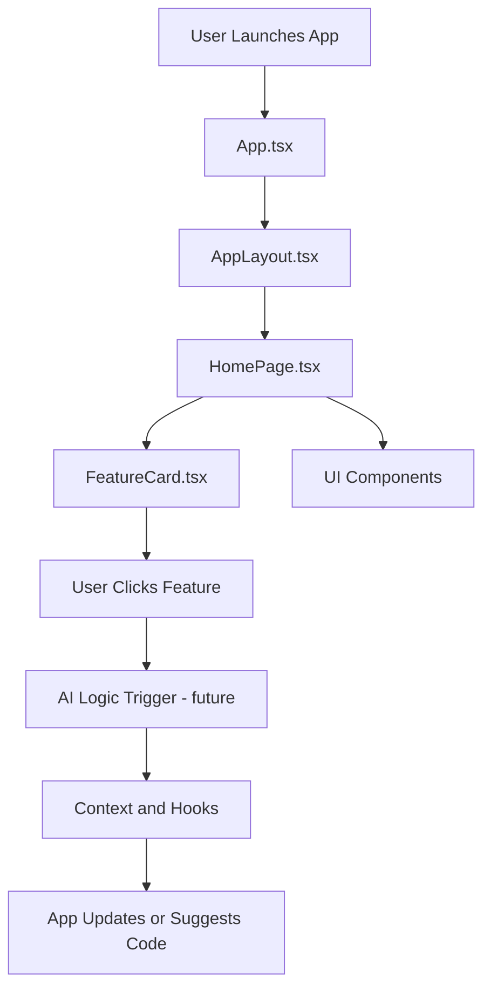

# 🧭 CodeCraft Compass

[](https://vitejs.dev)
[](https://opensource.org/licenses/MIT)
[](https://github.com/emcdo411/codecraft-compass)
[](https://github.com/emcdo411/codecraft-compass/commits/main)
[](https://react.dev)
[](https://www.typescriptlang.org/)
[](https://tailwindcss.com/)
[](https://vitejs.dev)
[](https://github.com/emcdo411/codecraft-compass/issues)
[](https://github.com/emcdo411/codecraft-compass/stargazers)


---

## 📚 Table of Contents

- [🧠 Project Summary](#-project-summary)
- [🛠️ Tech Stack](#️-tech-stack)
- [📦 Installed Packages](#-installed-packages)
- [📁 Folder Structure](#-folder-structure)
- [🧠 Why This Matters](#-why-this-matters)
- [🚀 Getting Started](#-getting-started)
- [🤝 Contributing](#-contributing)
- [📄 License](#-license)

---

## 🧠 Project Summary

**CodeCraft Compass** is a modern developer-friendly platform built with React, Tailwind CSS, and Vite to help aspiring engineers see what “good” and “great” code looks like in real-time. Designed to eventually plug into AI logic, this app serves as a guided mentor for writing better code.

---

## 🛠️ Tech Stack


---

## 📦 Installed Packages


---

## 📚 Table of Contents

* [🧠 Project Summary](#-project-summary)
* [🛠️ Tech Stack](#️-tech-stack)
* [📦 Installed Packages](#-installed-packages)
* [📁 Folder Structure](#-folder-structure)
* [🛠️ CodeCraft Compass Workflow](#-codecraft-compass-workflow)
* [🧠 Why This Matters](#-why-this-matters)
* [🚀 Getting Started](#-getting-started)
* [🤝 Contributing](#-contributing)
* [📄 License](#-license)

---

## 🧠 Project Summary

**CodeCraft Compass** is a modern developer-friendly platform built with React, Tailwind CSS, and Vite to help aspiring engineers see what “good” and “great” code looks like in real-time. Designed to eventually plug into AI logic, this app serves as a guided mentor for writing better code.

---

## 📁 Folder Structure

```
codecraft-compass/
├── public/
├── src/
│   ├── App.tsx
│   ├── main.tsx
│   └── index.css
├── index.html
├── package.json
├── postcss.config.js
├── tailwind.config.ts
├── tsconfig.json
├── tsconfig.node.json
├── vite.config.ts
└── README.md
```

---

## 🛠️ CodeCraft Compass Workflow



---

## 🧠 Why This Matters

Writing code is one thing—writing maintainable, scalable, and professional code is another. CodeCraft Compass is built to help bridge that gap by offering structure, modularity, and AI-enhanced guidance for new developers. It's your compass on the path to clean code.

---

## 🚀 Getting Started

### Prerequisites

* Node.js (v18+)
* npm (v9+)

### Steps

```bash
git clone https://github.com/emcdo411/codecraft-compass.git
cd codecraft-compass
npm install
npm run dev
```

---

## 🤝 Contributing

Pull requests are welcome!
Please fork the repository and open a PR with your changes. For major changes, open an issue first.

---

## 📄 License

This project is licensed under the MIT License.
See the [LICENSE](LICENSE) file for details.

```

Let me know when you're ready to add:
- 🧠 AI mock logic section
- ⚙️ `.bat` file automation steps
- 🌐 Deployment guide
- 📢 A LinkedIn launch post in your voice  
